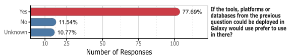

<!-- .slide: data-background="images/title.jpg" data-state="dim-background" -->
## The Microbiology Galaxy Lab <!-- .element style="color: white; background: black; padding-bottom: 20px" -->

#### The effort of the microGalaxy community to build the first community-driven gateway for reproducible and FAIR analysis of microbial data analysis

 

Engy Nasr, Nikos Pechlivanis, Nikolaos Strepis, the microGalaxy Community, Paul Zierep, **Bérénice Batut**

<small>Institut Francais de Bioinformatique / Auvergne Bioinformatique, Université Clermont Auvergne   She/her - <i class="fab fa-github"></i> @bebatut - <i class="fas fa-envelope"></i> berenice.batut@uca.fr</small>

<small>European Galaxy Days - October 2025</small>

<small style="position: absolute; right: 0%; font-size: 0.2em; ">Photo by [Elena Mozhvilo](https://unsplash.com/@miracleday?utm_source=unsplash&utm_medium=referral&utm_content=creditCopyText) on [Unsplash](https://unsplash.com/?utm_source=unsplash&utm_medium=referral&utm_content=creditCopyText) </small>

Note:

---
<!-- .slide: data-background="images/title.jpg" data-state="dim-background" -->

## Microbiology and Microbial data analysis <!-- .element style="color: white; background: black; padding-bottom: 20px" -->

----

Scientists study different organisms using different techniques and analyses...

 <!-- .element width="100%" style="margin: 50px 0 50px 0;" -->

<small style="position: absolute; left: 0%;">Survey conducted among the microbiology research community (March - September 2023) with 130 responses</small>

Note:
Furthermore, to gather community feedback, a survey was distributed to Galaxy users and shared with the microbial community beyond Galaxy. Questions were designed to assess current microbial workflow applications and identify areas for enhancement (Supplementary Document 1). The survey provides a granular look into the priorities and practices of the community of microbial bioinformaticians and researchers. The results show a clear focus on microbial multidisciplinary methodologies, with bacteria being the main target organism for a substantial proportion of respondents (44.4%, Fig. 1B, Supplementary Table 1). The top three techniques were split between single-organism genomics (23.9%), metagenomics (23.1%), and (meta)transcriptomics (22.3%), indicating diverse but clustered popular approaches. Regarding specific computational tasks, functional analysis (12.7%) is the most frequently used or desired analysis, followed closely by gene identification (12.4%) and genome assembly (11.0%).

----

Scientists study different organisms using different techniques and analyses and want to use Galaxy

 <!-- .element width="50%" style="margin: 50px 0 50px 0;" -->

<small style="position: absolute; left: 0%;">Survey conducted among the microbiology research community (March - September 2023) with 130 responses</small>

Note:
A Galaxy key strength is its modularity, allowing researchers to mix and integrate various tools and workflows for their specific research aims. As confirmed by the survey user surveys, accompanying tools and workflows with tutorials significantly increases their adoption.
The most insightful result regarding microbiology computational analysis is that the primary barrier to its adoption is lack of experience (51.9%) and technical difficulties (25.9%), and not lack of utility (Supplementary Table 1). This is underscored by the fact that an overwhelming number of respondents (77.7%) would prefer to use Galaxy if it integrated other tools and databases they needed (Fig. 1B). This presents a clear opportunity for a focused platform leveraging microbial tools to enhance the user experience.

---
<!-- .slide: data-background="images/title.jpg" data-state="dim-background" -->

## Could scientists use Galaxy for microbial data analysis? <!-- .element style="color: white; background: black; padding-bottom: 20px" -->

----

Resources for microbial analysis in Galaxy ...

 <!-- .element width="55%" -->

----

Resources for microbial analysis in Galaxy are highly used...

 <!-- .element width="55%" -->

----

Resources for microbial analysis in Galaxy are highly used for a wide range of key computational functions 

 <!-- .element width="75%" -->

----

----

---
<!-- .slide: data-background="images/title.jpg" data-state="dim-background" -->

## Do scientists use Galaxy for publications? <!-- .element style="color: white; background: black; padding-bottom: 20px" -->

----

28% of publications citing Galaxy are microbial-related papers

 <!-- .element width="55%" -->

Note:

Between 2020 and 2025, 4,891 publications relied on the Galaxy platform for their analysis, of which 1,911 were specifically focused on microbial analysis

Among these, 559 studies (29.3%) addressed health and disease applications, 364 (19.0%) focused on ecosystems and biodiversity, and a significant portion, 988 publications (51.7%), bridged both domains, reflecting the growing interdisciplinarity of microbial research

Within this subset, (meta)genomics, a computationally intensive field, was the most prevalent application, followed by metabarcoding and metatranscriptomics. This focus on meta-omics studies reflects the inherent complexity of microbiological data and diversity. Key analytical functions identified in the literature included taxonomic classification, functional analysis, and antimicrobial resistance (AMR) gene profiling, with target taxonomic groups spanning bacteria, pathogens, microbiomes, and viruses

----

Phylogenetic and genetic analysis of *Klebsiella pneumoniae* ST512

<small style="position: absolute; left: 0%;">Genotypic evolution under treatment with ceftazidime/avibactam, meropenem/vaborbactam, and cefiderocol</small>

 <!-- .element style="margin: 60px 0 0 0;" -->

<small style="position: absolute; left: 0%;">Figure 2 in [Arcari *et al.*, 2023](https://doi.org/10.3201/eid2911.230921)</small>

----

Comparative distribution of dominant bacterial and eukaryotic orders in cloudy versus clear-atmosphere metagenomes

 <!-- .element style="margin: 50px 0 0 0;" -->

<small style="position: absolute; left: 0%;">Figure 1 in [Péguilhan *et al.*, 2025](https://doi.org/10.5194/bg-22-1257-2025)</small>

----

Glycolysis/Gluconeogenesis pathway of a *Tissierellia*-class bacterium

<small style="position: absolute; left: 0%;">Built as a Metagenomics Assembled Genome from metagenomics data and annotated with metaproteomic abundance </small>

 <!-- .element width="30%" style="margin: 60px 0 0 0;" -->

<small style="position: absolute; left: 0%;">Figure 3 in [Schiml *et al.*, 2023](https://doi.org/10.1186/s40793-023-00514-9)</small>

----

30 differentially expressed biochemical pathways in traumatic brain injury (TBI) versus control fecal metatranscriptomes

 <!-- .element width="35%" -->

<small style="position: absolute; left: 0%;">Figure 3 in [Pyles *et al*, 2024](https://doi.org/10.3389/fnmol.2024.1341808)</small>

---
<!-- .slide: data-background="images/title.jpg" data-state="dim-background" -->

## What can we do to help scientists finding the most useful resources for their microbial data analyses? <!-- .element style="color: white; background: black; padding-bottom: 20px" -->

----

 <!-- .element width="60%" -->

----

A Lab is a subdomain of a Galaxy server with a custom landing page and tool box

 <!-- .element width="65%" -->

<small style="position: absolute; left: 0%;">Figure 1 in [Hyde *et al*, 2025](https://doi.org/10.20944/preprints202508.0199.v1)</small>

----

We followed the Lab life-cycle to build the Microbiology Galaxy Lab

 <!-- .element width="50%" -->

<small style="position: absolute; left: 0%;">Figure 2 in [Hyde *et al*, 2025](https://doi.org/10.20944/preprints202508.0199.v1)</small>

----

- We developed to Galaxy Codex to collect tools/workflows/tutorials and link them to bio.tools, WorkflowHub, EDAM, etc
- We curated tools, workflows and training
- We improved the annotations of 100+ tool suites

----

We offer **880+ tools** in **315+ tool suites**

 <!-- .element width="55%" -->

----

We offer **880+ tools** in **315+ tool suites**, **115+ workflows**

 <!-- .element width="50%" -->

----

We offer **880+ tools** in **315+ tool suites**, **115+ workflows** and **35+ tutorials**.

 <!-- .element width="70%" -->

----

We followed the Lab life-cycle to build the Microbiology Galaxy Lab

 <!-- .element width="50%" -->

<small style="position: absolute; left: 0%;">Figure 2 in [Hyde *et al*, 2025](https://doi.org/10.20944/preprints202508.0199.v1)</small>

----

Building a Lab mostly consist in filling in YAML and Markdown files

 <!-- .element width="70%" -->

<small style="position: absolute; left: 0%;">Figure 3 in [Hyde *et al*, 2025](https://doi.org/10.20944/preprints202508.0199.v1)</small>

----

We followed the Lab life-cycle to build the Microbiology Galaxy Lab

 <!-- .element width="50%" -->

<small style="position: absolute; left: 0%;">Figure 2 in [Hyde *et al*, 2025](https://doi.org/10.20944/preprints202508.0199.v1)</small>

----

The Microbiology Galaxy Lab is available on:
- ORG: [microbiology.usegalaxy.org](http://microbiology.usegalaxy.org)
- EU: [microbiology.usegalaxy.eu](http://microbiology.usegalaxy.eu)
- ORG.AU: [microbiology.usegalaxy.org.au](http://microbiology.usegalaxy.org.au)
- FR: [microbiology.usegalaxy.fr](http://microbiology.usegalaxy.fr)
- BE?
- CZ?

----

We followed the Lab life-cycle to build the Microbiology Galaxy Lab

 <!-- .element width="50%" -->

<small style="position: absolute; left: 0%;">Figure 2 in [Hyde *et al*, 2025](https://doi.org/10.20944/preprints202508.0199.v1)</small>

---
 
 <!-- .element width="60%" -->

---

## Thank You!

 <!-- .element width="20%" -->

The microGalaxy community!

 <!-- .element width="100%" -->
 

 <!-- .element width="100%" -->

 <!-- .element width="60%" -->

---

Test the Lab and give us feedback: [microbiology.usegalaxy.org](http://microbiology.usegalaxy.org) / [eu](http://microbiology.usegalaxy.eu) / [org.au](http://microbiology.usegalaxy.org.au) / [fr](http://microbiology.usegalaxy.fr)

Read our preprint
 <!-- .element width="50%" -->

